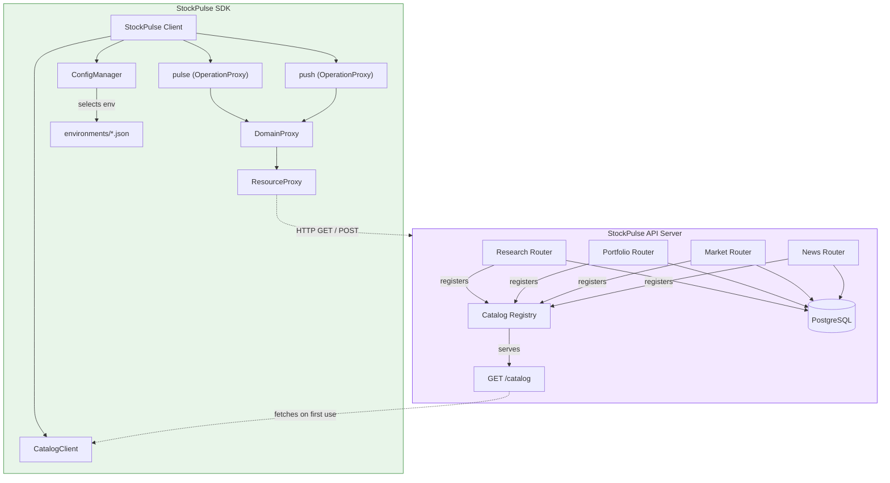
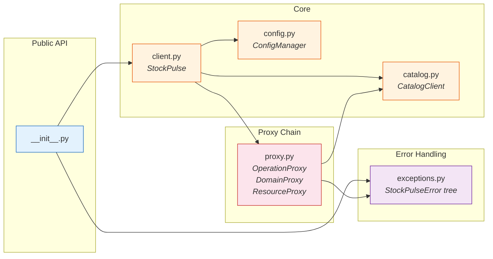
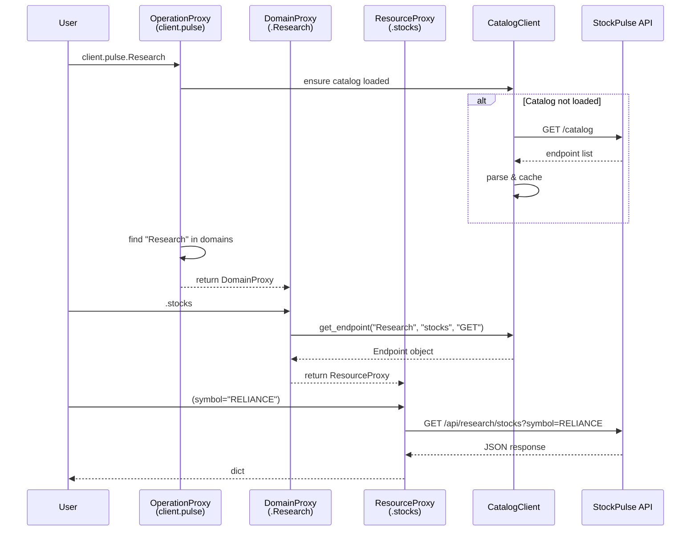
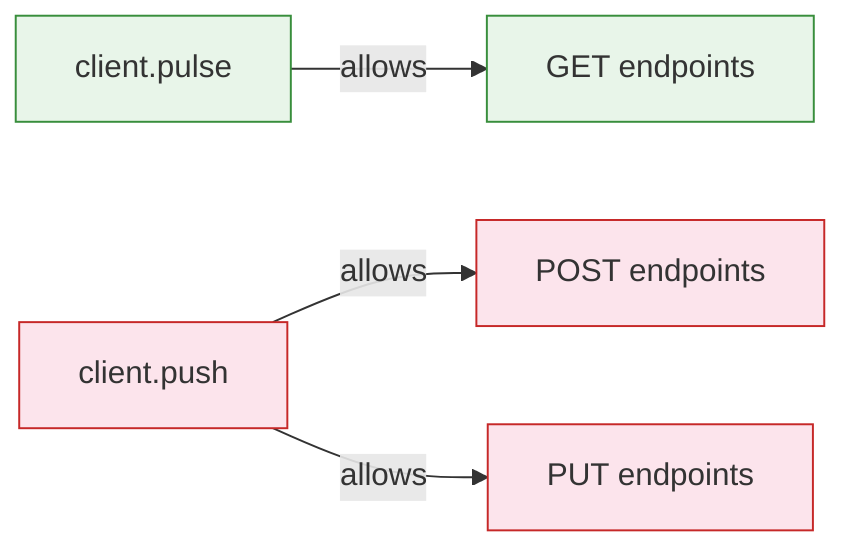
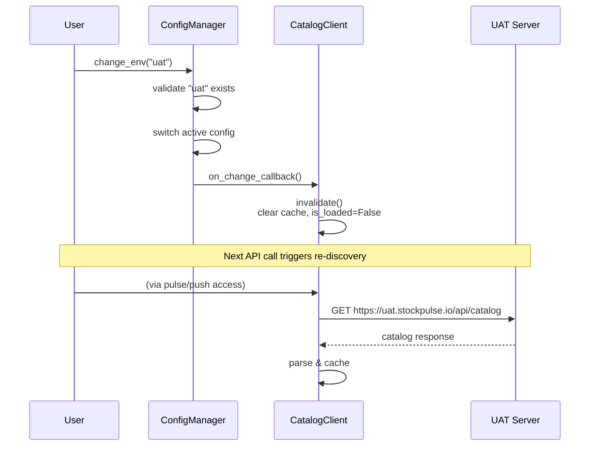
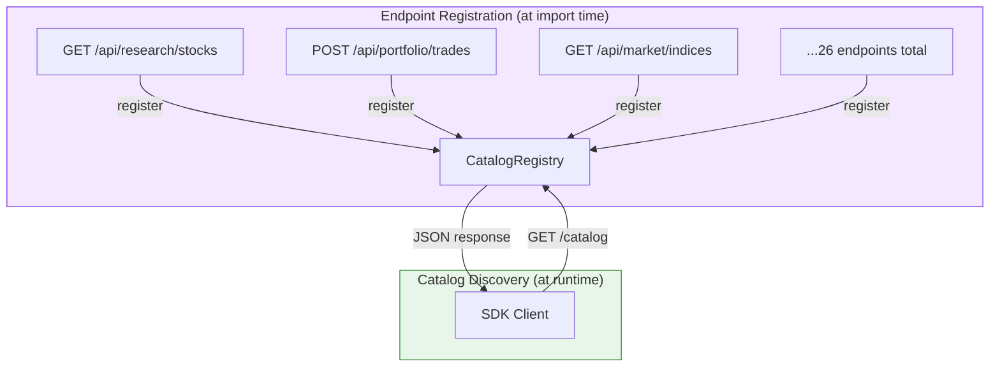

# Architecture

## System Overview

StockPulse is a two-component system: an **API server** that self-documents its endpoints via a catalog registry, and an **SDK** that reads that catalog at runtime to dynamically build a typed client interface.



---

## Module Breakdown

The SDK is composed of six focused modules, each with a single responsibility.



| Module | Class | Responsibility |
|--------|-------|----------------|
| `client.py` | `StockPulse` | Main entry point. Wires together config, catalog, and proxy layers. Exposes `pulse`, `push`, `config`, and `catalog()`. |
| `config.py` | `ConfigManager` | Loads bundled environment JSON files. Handles `change_env()`, `register_env()`, and fires cache invalidation callbacks. |
| `catalog.py` | `CatalogClient` | Fetches `GET /catalog` from the API server, parses endpoint metadata into `Endpoint` dataclasses, and caches results. |
| `proxy.py` | `OperationProxy` | Resolves domain names from `client.pulse.<Domain>`. Filters endpoints by HTTP method (GET for pulse, POST/PUT for push). |
| `proxy.py` | `DomainProxy` | Resolves resource names from `client.pulse.Domain.<resource>`. Searches catalog for matching endpoint. |
| `proxy.py` | `ResourceProxy` | The callable endpoint. Executes HTTP requests and returns parsed JSON. Exposes `.info` for introspection. |
| `exceptions.py` | `StockPulseError` tree | Structured exception hierarchy: `DomainNotFoundError`, `ResourceNotFoundError`, `ApiError`. |

---

## The Proxy Chain

The proxy chain is the core pattern that enables dot-notation access. Each attribute access resolves one layer deeper until you reach a callable.



### How Each Layer Maps

| Expression | Layer | What Happens |
|-----------|-------|-------------|
| `client.pulse` | Property | Returns pre-built `OperationProxy(operation="pulse")` |
| `.Research` | `OperationProxy.__getattr__` | Triggers lazy catalog load, validates domain exists, returns `DomainProxy` |
| `.stocks` | `DomainProxy.__getattr__` | Finds endpoint matching domain + resource + allowed HTTP method, returns `ResourceProxy` |
| `(symbol="RELIANCE")` | `ResourceProxy.__call__` | Builds URL, sends HTTP request, returns parsed JSON |

### Operation Method Routing

The operation type determines which HTTP methods are considered when resolving resources:



This is why `client.push.Market.indices` raises `ResourceNotFoundError` — indices only has a GET endpoint, and `push` only looks for POST/PUT.

---

## Environment Switch & Cache Invalidation

When you call `change_env()`, the SDK invalidates its catalog cache to ensure endpoints are re-discovered from the new server.



Each environment may expose different endpoints. For example, a `dev` server might have debug routes that `prd` doesn't. Cache invalidation ensures the SDK always reflects the correct API surface.

---

## Catalog Discovery

The API server uses an auto-registration pattern. Each router registers its endpoints with the global catalog at import time:

```python
# Inside the API server (e.g., research/router.py)
catalog.register(
    domain="Research",
    resource="stocks",
    method=HttpMethod.GET,
    path="/api/research/stocks",
    description="Get stock quote and details",
    params=[
        ParamInfo(name="symbol", type="string", required=False)
    ],
)
```

The `GET /catalog` endpoint returns all registered entries:



### Catalog Entry Structure

Each entry carries enough metadata for the SDK to build its proxy tree:

```json
{
  "domain": "Research",
  "resource": "stocks",
  "method": "GET",
  "path": "/api/research/stocks",
  "description": "Get stock quote and details",
  "params": [
    {
      "name": "symbol",
      "type": "string",
      "required": false,
      "description": "Stock symbol (e.g. RELIANCE). Omit to get all."
    }
  ]
}
```

The SDK uses `domain` to build domains, `resource` to build resource accessors, `method` to route between `pulse` and `push`, and `path` to construct the request URL.

---

## File Structure

```
stockpulse-sdk/
├── stockpulse/
│   ├── __init__.py              # Public exports: StockPulse, exceptions
│   ├── client.py                # StockPulse main client class
│   ├── config.py                # ConfigManager + EnvConfig dataclass
│   ├── catalog.py               # CatalogClient — fetch, parse, cache
│   ├── proxy.py                 # Three-layer proxy chain
│   ├── exceptions.py            # Exception hierarchy
│   └── environments/            # Bundled environment configs
│       ├── dev.json
│       ├── sit.json
│       ├── uat.json
│       └── prd.json
├── tests/
│   ├── test_client.py           # End-to-end client tests
│   ├── test_config.py           # ConfigManager unit tests
│   ├── test_catalog.py          # CatalogClient unit tests
│   └── test_proxy.py            # Proxy chain unit tests
├── docs/                        # MkDocs documentation source
├── mkdocs.yml                   # Documentation site config
└── pyproject.toml               # Project metadata and dependencies
```

---

## Design Decisions

### Why a proxy chain instead of code generation?

Code generation requires rebuilding the SDK whenever the API changes. The proxy chain discovers endpoints at runtime — deploy a new endpoint, register it in the catalog, and every SDK instance picks it up on the next catalog load. **Zero SDK releases needed for API changes.**

### Why separate `pulse` and `push`?

Making the operation type explicit prevents accidental mutations. `client.pulse.Portfolio.trades()` is physically incapable of creating a trade — it only resolves to GET endpoints. Write operations require the conscious choice of `client.push`.

### Why lazy catalog loading?

Constructing `StockPulse()` should be instantaneous. The `/catalog` HTTP call only happens when you actually access an endpoint. This means import-time and initialization have zero network overhead.

### Why case-insensitive matching?

Developer ergonomics. During interactive exploration in a REPL or notebook, `client.pulse.research.stocks()` is as valid as `client.pulse.Research.stocks()`. The extra flexibility reduces friction without introducing ambiguity.

### Why JSON files for environments?

Environment configs are static, declarative data — JSON is the natural fit. Bundling them as package data means they ship with the SDK and require no external configuration. The `register_env()` escape hatch handles cases where bundled configs aren't sufficient.
